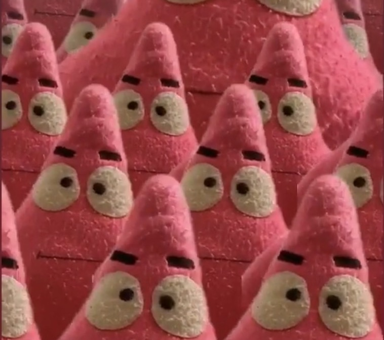

```{r setup, include=FALSE}
knitr::opts_chunk$set(echo = TRUE)
library(fontawesome)
```

<div class="logo">
  
  <br>
  <p style="text-align:center"><b>Tzu-Yung Kuo<br>
  Data Scientist<br>
  <p style="text-align:center">Contact: <a href="https://www.linkedin.com/in/tzuyungkuo/">`r fa("linkedin")`</a>&nbsp;<a href="mailto:e8r5i0c7e2r2@hotmail.com">`r fa("at", fill="#be1919")`</a>&nbsp;<a href="https://github.com/ericKuo722/erickuo_web">`r fa("github",fill="#511f1f")`</a></b></p>
</div>

\

<h1 style="text-align:center; font-size: 40px;"> Welcome To My Project Website</h1>

\

<div class="styled-paragraph">
  <p style="text-align: justify; font-size: 20px;">Hey there! 🚀 Welcome to my little corner of the internet where I geek out about all things data-related! 🤓 Here, you'll find a bunch of cool projects I've whipped up using RStudio.
  <br>I might also whip up some Python tutorials on data pre-processing and training ML models down the road if I find the time.</p>
</div>


